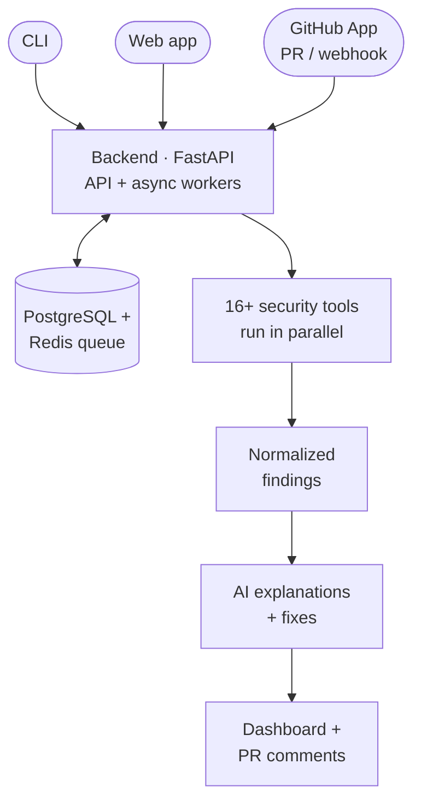

<h1 align="center">DevSecureX</h1>

<strong>Ship secure code by default.</strong>

A security-scanning platform that analyzes code across <strong>20+ languages</strong> using
<strong>16+ industry-standard tools</strong> — catching vulnerabilities, leaked secrets, and
compliance gaps before they reach production, with AI-powered explanations and fixes.

  <a href="https://github.com/apps/devsecurex-scanner"><strong>Install the DevSecureX Scanner GitHub App →</strong></a>

---

## The Platform

DevSecureX is built as three focused components that work together:

| Repository | What it does | Stack |
| --- | --- | --- |
| **[backend](https://github.com/DevSecureX/backend)** | API & scanning engine — orchestrates 16+ security tools through an async, queue-backed worker pipeline | FastAPI · PostgreSQL · Redis · Docker |
| **[cli](https://github.com/DevSecureX/cli)** | Terminal & CI/CD scanner with SARIF output and compliance reporting | Node.js |
| **[frontend](https://github.com/DevSecureX/frontend)** | Dashboards, scan results, pull-request review, custom rules & analytics | React · TypeScript · Vite (PWA) |

## What it does

- **Multi-language scanning** — 20+ languages and frameworks in one pass
- **16+ security tools** — Semgrep, Bandit, Gosec, Brakeman, SpotBugs, CppCheck, ESLint Security, Trivy, TruffleHog, GitLeaks, Checkov, Safety and more
- **Full coverage** — SAST, dependency scanning, secrets detection, and infrastructure-as-code
- **AI-powered** — plain-English vulnerability explanations and automated fix suggestions
- **GitHub-native** — pull-request scanning, webhooks, and inline review comments
- **Compliance reporting** — OWASP Top 10 mapping and SARIF output for any pipeline
- **Real-time** — Redis-backed async workers with live scan progress

## GitHub App

**[DevSecureX Scanner](https://github.com/apps/devsecurex-scanner)** is the published GitHub
App that brings the platform straight into your workflow — install it on a repository and it
automatically reviews pull requests for security issues before they go live, explaining each
finding in plain English and suggesting fixes.

**[Install the DevSecureX Scanner →](https://github.com/apps/devsecurex-scanner)**

## How it fits together

A scan is triggered from the **CLI**, the **web app**, or a **GitHub pull request** (via the
[DevSecureX Scanner](https://github.com/apps/devsecurex-scanner) app). The **backend** queues
the job, fans it out across the relevant security tools in parallel, normalizes the findings,
optionally enhances them with AI, and surfaces the results in the dashboard and back on the PR.

---

Designed, built, and maintained end-to-end by <a href="https://github.com/harshaltribhuwan">Harshal Tribhuvan</a>
— architecture, backend, CLI, and frontend.

